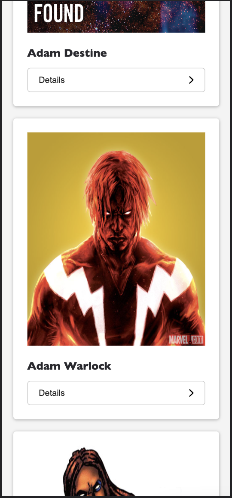
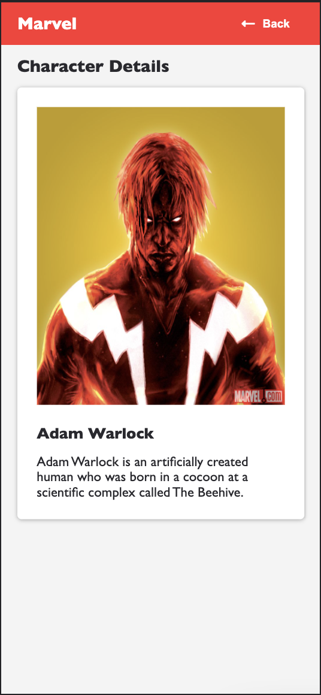

<h1 align="center">Marvel Characters</h1>

<div align="center">
    
    
</div>

---

##  About

This is a simple web **ReactJS page** that searches for Marvel characters using Marvel's API.

## Technologies

- [ReactJS](https://reactjs.org)
- [Yarn](https://yarnpkg.com/)
- [Axios](https://github.com/axios/axios)

Building
---

````
step 1: Get the clone
step 2: Access the project name
step 3: Type yarn dev to start
````
---
Developed by - Renato Souza.
